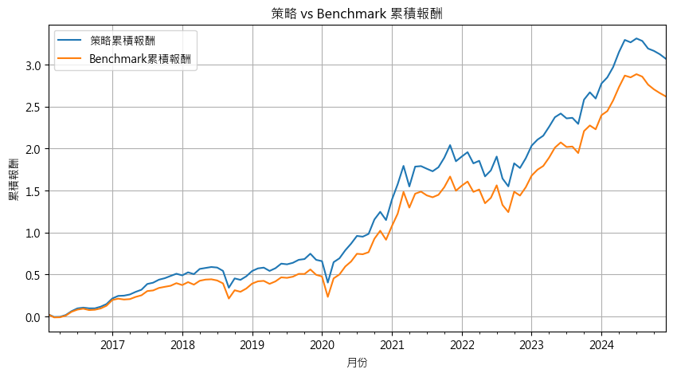
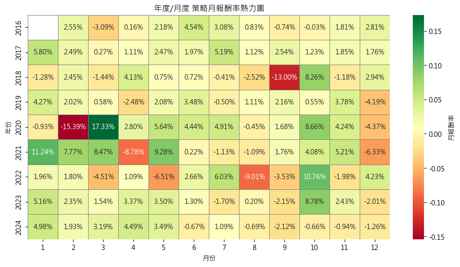

# 📊 Multi-Factor Spectral AI Strategy（MSAI）
### 多因子選股光譜策略｜多因子 + PLS 降維 + LightGBM 選股框架

> 💡 **策略命名由來：**
>
> * **Multi-Factor**：策略融合四大核心面向 —— 籌碼、營收、技術與歷史報酬，全面反映市場訊號。
> * **Spectral（光譜）**：呼應使用 **PLS（Partial Least Squares）** 降維技術，將多維資料壓縮為潛在結構，就如同用光譜分析市場訊號。
> * **AI Strategy**：運用 **LightGBM** 模型處理非線性結構，結合滾動視窗回測，建構出具備預測力與穩定性的智慧選股策略。
>
> 本專案為一套完整的台股量化選股系統，涵蓋：因子處理、降維建模、滾動回測與績效視覺化，並具備高度模組化結構，方便擴充與部署。

---

## 🔥 資料描述以及策略回測績效總覽（2016–2024）

> 回測樣本：所有上市(下市)公司。
>
> 回測年分：2013 到 2024，月頻率資料。
>
> 策略使用 **滾動視窗機制**，採 2 年訓練 + 1 年驗證 + 1 個月測試的方式進行回測，評估模型在不同時期的穩定性與適應性。

| 類別        | 說明                  | 雲端資料連結 |
|-------------|-----------------------|-----------|
| 數據集  | 包含原始資料、整理後資料   | [雲端](https://reurl.cc/GnzQVy) |

### 📊 策略累積報酬 vs Benchmark



### 🌡️ 月報酬率熱力圖（年度 × 月份）



---

## 📁 資料下載連結

| 類別        | 說明                  | 雲端資料連結 |
|-------------|-----------------------|-----------|
| 數據集  | 包含原始資料、整理後資料   | [雲端](https://reurl.cc/GnzQVy) |

---

### 📌 關鍵績效指標比較

| 指標項目               | 策略表現 | Benchmark 表現 |
|------------------------|---------:|----------------:|
| 年化報酬率 (%)          |    17.05 |           15.53 |
| 年化波動率 (%)          |    15.47 |           15.71 |
| Sharpe Ratio           |     1.10 |            0.99 |
| Sortino Ratio          |     1.98 |            1.76 |
| 勝率 (%)               |    68.22 |           67.29 |
| 最大回撤 (%)           |   -19.68 |          -20.95 |
| Calmar Ratio           |     0.87 |            0.74 |
| 盈虧比（P/L Ratio）    |     1.13 |            1.09 |

> 📈 策略展現良好的風險報酬特性，長期年化報酬優於 Benchmark，並具備更高 Sharpe / Sortino 與較低回撤。

---

## 🧠 策略因子邏輯設計

### 🏦 1️⃣ 籌碼面因子

法人（外資、投信、自營商）掌握市場優勢資訊，其持股與交易行為可視為預期的投射。  
但單一籌碼指標易受事件擾動，故策略使用 PLS 將多種籌碼資料

- 月平均週轉率
- 月平均持股比例

並考量產業別壓縮成潛在因子，並透過滾動訓練持續更新訊號解釋力。

---

### 📃 2️⃣ 營收面因子

營收是企業基本面核心資料，惟其公布時間與操作時間存在資訊落差。  
因此策略不以單月資料為依據，而是設計中長期觀察指標，如：

- 累計營收成長率
- 近 3 月營收均值 vs 12 月均值
- 是否創新高/低
- 產業分類作為補強因子

經由 PLS 統整為穩定性與趨勢兼具的營收潛因子。

---

### 📈 3️⃣ 技術面因子

價格與量的即時變化代表市場情緒與共識。策略納入以下技術類變數：

- 週轉率（月）、成交比重
- 股價淨值比（P/B）、股價營收比（P/S）
- 股利殖利率與現金股利率
- 高低價差比

以 PLS 降維後納入模型，並搭配滾動訓練動態調整技術因子在不同時期的預測權重。

---

### 📊 4️⃣ 歷史報酬因子

策略不預設報酬是動能或反轉，而是同時納入多期間報酬進行光譜分析：

- 本週、本月、本季、本年報酬率
- 對應超額報酬（相對大盤）
- 檢視正向動能與潛在反轉的交互作用

透過 PLS 壓縮為一個歷史報酬潛因子，供 LightGBM 學習其與未來報酬之關聯。

---

## 🧩 策略流程架構

```mermaid
graph TD
A[原始多因子資料] --> B[PLS 降維]
B --> C[四大潛在因子]
C --> D[LightGBM 預測模型]
D --> E[滾動視窗回測]
E --> F[報酬、勝率、回撤等績效評估]

